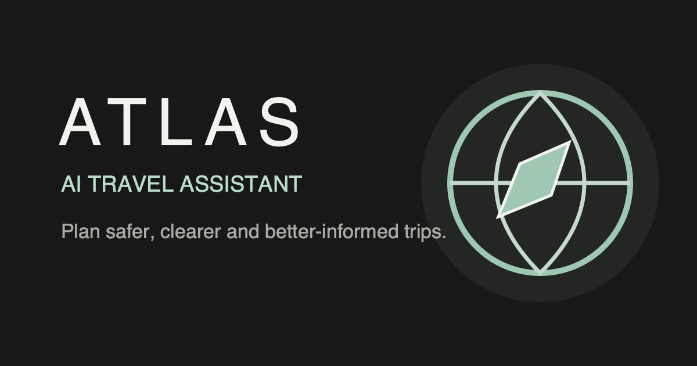
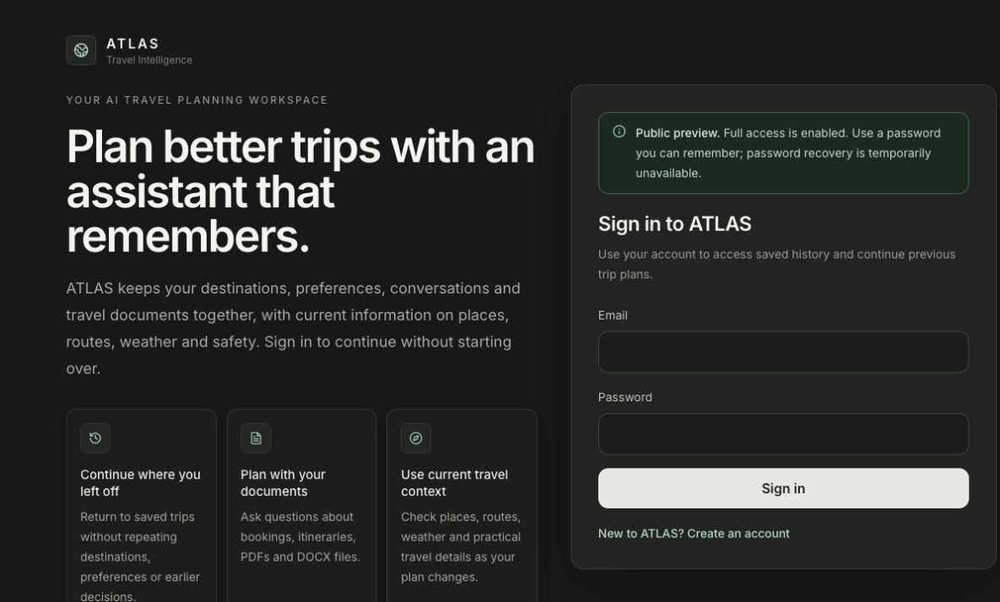

# ATLAS — Agentic AI Travel Assistant

  

  An agentic travel-planning workspace with live travel context, conversation memory, document-aware chat and privacy-first account controls.

  <a href="https://atlas.51.21.25.3.nip.io/"><strong>Live public preview</strong></a>
  ·
  <a href="https://github.com/Sub1nn/ATLAS-A-Complete-AI-Travel-Assistant/actions/workflows/ci.yml"><strong>CI</strong></a>
  ·
  <a href="TRAVEL_RESPONSE_FLOW.md"><strong>Response architecture</strong></a>
  ·
  <a href="DOCKER_DEPLOYMENT.md"><strong>Deployment guide</strong></a>

  
  
  
  
  

## Live preview

**Try ATLAS:** https://atlas.51.21.25.3.nip.io/

> [!IMPORTANT]
> This deployment is a controlled portfolio preview, not an unrestricted public-production claim. Email verification is temporarily optional, password recovery is unavailable, provider usage is capped and new preview accounts default to 30-day data retention. Use a password you can remember and do not upload sensitive documents.

## Why ATLAS

ATLAS is more than a prompt wrapped in a chat interface. It resolves travel intent, preserves relevant constraints across follow-ups, selects bounded specialist tools, gathers current evidence and verifies the final response before presenting it in a readable travel-planning layout.

| Capability | What it provides |
| --- | --- |
| Agentic planning | LangGraph coordinates context resolution, planning, tool selection, composition, verification and one bounded repair pass |
| Live travel intelligence | Places, routes, geocoding, local time, weather, news and local discovery are gathered only when relevant |
| Contextual conversations | Destinations, origin, dates, pace, accessibility, budget and preferences survive appropriate follow-ups without leaking stale locations |
| Document-aware chat | PDF, DOCX and TXT content is extracted in a constrained worker and retrieved through user-isolated Pinecone namespaces |
| Structured responses | Intent-specific renderers produce clear routes, itineraries, dining, accommodation, activity, weather and safety sections |
| Privacy controls | Users can export data, change retention, delete conversations and trigger durable account deletion across application stores |
| Resilient providers | Timeouts, bounded retries, circuit breakers, caching, rate limits and daily cost budgets protect availability and spend |

## Architecture

~~~mermaid
flowchart TB
    User[Traveller] --> Edge[TLS reverse proxy]
    Edge --> Web[React + Vite UI Nginx]
    Web --> API[Express API]

    API --> Auth[Auth, sessions, CSRF privacy controls]
    API --> Graph[Authoritative LangGraph workflow]

    Graph --> Context[Context and memory resolution]
    Context --> Planner[Structured LangChain planner]
    Planner --> Tools[Bounded specialist tools]
    Tools --> Compose[Evidence-grounded composition]
    Compose --> Verify[Quality verification and one repair pass]

    Tools --> Google[Google Maps Platform]
    Tools --> Weather[OpenWeather]
    Tools --> News[NewsAPI]
    Tools --> Yelp[Yelp]
    Planner --> Groq[Groq]

    API --> Mongo[(MongoDB replica set)]
    API --> Redis[(Redis)]
    API --> Pinecone[(Pinecone)]

    Docs[Document worker] --> Mongo
    Docs --> Pinecone
    Privacy[Privacy and deletion worker] --> Mongo
    Privacy --> Pinecone
    Retention[Retention worker] --> Mongo

    Graph -. sanitized structural traces .-> LangSmith[LangSmith]
~~~

### Response workflow

1. Resolve the current intent, destination changes and inherited constraints.
2. Build a structured plan and select only the tools needed for that request.
3. Execute provider calls with timeouts, budgets and bounded concurrency.
4. Compose an answer from retrieved evidence using intent-specific layouts.
5. Verify location relevance, required constraints, unsupported claims and response quality.

Exact live facts such as route duration, weather observations and provider-backed place details remain deterministic. Language-model output is schema-controlled and cannot silently replace grounded provider data.

## Technology stack

| Layer | Technologies |
| --- | --- |
| Frontend | React 18, Vite 8, Tailwind CSS, Axios, Lucide |
| API | Node.js 20.19+, Express, Mongoose, Zod, Helmet |
| Agent workflow | LangGraph, LangChain, ChatGroq, Groq, optional sanitized LangSmith tracing |
| Data | MongoDB 7 replica set, Redis, Pinecone |
| Travel providers | Google Places API (New), Routes API v2, Geocoding API, Time Zone API, OpenWeather, NewsAPI, Yelp |
| Documents | Multer, pdf-parse, Mammoth, constrained child-process extraction |
| Infrastructure | Docker Compose, Nginx, GitHub Actions; public preview on AWS EC2 behind Caddy TLS |

## Engineering highlights

### Context and memory

- Short-term conversation state is stored with each MongoDB conversation.
- LangGraph checkpoints use deterministic, pseudonymous thread identifiers.
- Destination switches clear stale place and activity context.
- Same-trip follow-ups retain relevant dates, origins, accessibility needs, exclusions and travel mode.
- Conversation reset, retention and deletion also remove related agent checkpoints.

### Authentication and privacy

- Short-lived JWT access tokens are held in memory rather than durable browser storage.
- Refresh sessions use rotating HttpOnly cookies with CSRF protection.
- Policy acceptance and retention settings are persisted per user.
- Account deletion runs as a durable, retryable worker job.
- Deletion covers sessions, conversations, messages, uploads, extracted content, checkpoints, Redis rate-limit state and the user’s Pinecone namespace.
- A pseudonymous deletion-status receipt remains temporarily available without retaining the deleted account identity.

### Reliability and cost control

- Redis-backed caching and distributed rate limits with explicit development behaviour.
- Provider-specific timeouts, retryable-status handling, exponential backoff and circuit breakers.
- Per-user and global daily provider and LLM budgets.
- Idempotent chat requests and ownership-fenced conversation writes.
- Durable document and account-deletion leases.
- Worker heartbeats, queue-age checks, dead-letter reporting and readiness gating.

### Responsible travel output

- Safety summaries separate retrieved news attention from official travel advice.
- Country-level customs guidance avoids claiming legal clearance without current authoritative evidence.
- Google attribution remains visible where required.
- Places-derived content is not treated as durable user-owned data.
- Accommodation results are comparison guidance only; ATLAS does not collect payment-card data or perform direct bookings.

## Repository structure

~~~text
.
├── backend/
│   ├── agents/          # LangGraph state, nodes, models and tracing
│   ├── config/          # Providers, rate limits and environment behaviour
│   ├── controllers/     # Auth, chat, conversations, documents and privacy
│   ├── models/          # MongoDB persistence and durable job records
│   ├── routes/          # Express API routes
│   ├── services/        # Tools, memory, documents, deletion and orchestration
│   ├── scripts/         # Tests, workers, diagnostics, load and index jobs
│   └── utils/
├── frontend/
│   ├── public/
│   ├── scripts/         # Frontend contract tests
│   └── src/             # React components, hooks, API client and renderers
├── docs/images/
├── .github/workflows/
├── docker-compose.yml
├── DOCKER_DEPLOYMENT.md
├── PINECONE_RAG_SETUP.md
└── TRAVEL_RESPONSE_FLOW.md
~~~

## Quick start with Docker

### Prerequisites

- Docker with Compose
- Git
- Provider credentials for the features you want to enable

Clone the repository:

    git clone https://github.com/Sub1nn/ATLAS-A-Complete-AI-Travel-Assistant.git
    cd ATLAS-A-Complete-AI-Travel-Assistant

Create local environment files:

    cp backend/.env.example backend/.env
    cp frontend/.env.example frontend/.env

Add your required secrets to **backend/.env**, then start the complete stack:

    docker compose up --build

Open:

- Frontend: http://localhost:5173
- Backend: http://localhost:4000
- Health: http://localhost:4000/health
- Readiness: http://localhost:4000/health/ready

Docker Compose starts MongoDB as a replica set, Redis, the one-shot index migration, the API, all three workers and the frontend. Persistent volumes keep MongoDB and Redis data across normal restarts.

Stop the stack:

    docker compose down

Remove the stack and local database/cache volumes:

    docker compose down -v

> [!CAUTION]
> The volume-removal command permanently deletes local MongoDB and Redis data.

## Local development

Use Node.js 20.19 or newer. CI and Docker use Node.js 22.

Install dependencies:

    cd backend
    npm ci
    cd ../frontend
    npm ci

Start the shared data services from the repository root:

    docker compose up -d mongo redis

Run the database index migration:

    cd backend
    npm run db:indexes

Start the API and frontend in separate terminals:

    cd backend
    npm run dev

    cd frontend
    npm run dev

For complete document, deletion and retention behaviour, run these backend processes separately:

    npm run worker:documents
    npm run worker:privacy
    npm run worker:retention

## Configuration

The checked-in examples are the source of truth:

- **backend/.env.example** — API, database, providers, workers, security and observability
- **frontend/.env.example** — browser-safe Vite configuration
- **.env.example** — root Docker Compose defaults

Important rules:

- Never commit populated environment files.
- Use one server-side Google Maps Platform key: **GOOGLE_MAPS_SERVER_API_KEY**.
- Keep any browser Maps JavaScript key separate as **VITE_GOOGLE_MAPS_API_KEY**.
- Never expose the server key through Vite.
- Production requires a MongoDB replica set and **MONGODB_TRANSACTIONS=true**.
- Redis is required by the production Compose services.
- Mailtrap Sandbox is staging-only; production email delivery uses Resend with a verified domain.
- LangSmith tracing is optional and should use low sampling with the repository’s sanitized trace payloads.

## API overview

| Area | Main endpoints |
| --- | --- |
| Authentication | **/api/auth/signup**, **/api/auth/login**, **/api/auth/refresh**, **/api/auth/me** |
| Privacy | **/api/auth/data-export**, **/api/auth/privacy-settings**, **/api/auth/account** |
| Chat | **/api/chat**, **/api/reset-context**, **/api/context/:conversationId** |
| Conversations | **/api/conversations** and **/api/conversations/:id** |
| Documents | **/api/documents**, **/api/documents/upload**, retry and deletion routes |
| Operations | **/health**, **/health/live**, **/health/ready** and protected internal metrics |

See the route modules under **backend/routes/** for the complete contracts.

## Testing

Backend unit and regression suite:

    cd backend
    npm test

Frontend contract tests, lint and production build:

    cd frontend
    npm test
    npm run lint
    npm run build

Replica-set integration tests:

    cd backend
    npm run test:integration

Additional operational checks:

    npm run diagnostic
    npm run test-setup
    npm run test:load:authenticated
    npm run test:soak

Container validation:

    docker compose config -q
    docker compose build

GitHub Actions runs backend and frontend checks, container builds, replica-set integration tests and the authenticated regression load on pushes and pull requests.

## Deployment

The public preview currently runs on a small AWS EC2 instance using:

- Caddy for TLS termination
- Nginx for the built React application
- Express API
- MongoDB 7 replica set
- Redis with append-only persistence
- Separate document, privacy/deletion and retention workers
- Health checks and restart policies for every long-running application process

The deployment uses intentionally low provider budgets because it is a portfolio preview. A broader production launch should move secrets to a managed secret store, use managed databases with tested backups, add external alerts and billing alarms, and validate multi-instance behaviour under realistic sustained load.

See [DOCKER_DEPLOYMENT.md](DOCKER_DEPLOYMENT.md) for the general container deployment model.

## Public-preview limitations

- Email verification is temporarily optional and an MX-domain check does not prove mailbox ownership.
- Password recovery is disabled until a verified sending domain is configured.
- Provider and LLM requests have deliberately low daily limits.
- External data can be delayed, incomplete or unavailable.
- Safety, entry, health, customs, legal, price and availability information must be verified with authoritative sources.
- Direct hotel booking and payment handling are outside the current scope.

## Documentation

- [Production and Docker deployment](DOCKER_DEPLOYMENT.md)
- [Pinecone document retrieval](PINECONE_RAG_SETUP.md)
- [Travel response and orchestration flow](TRAVEL_RESPONSE_FLOW.md)
- [Repository agent instructions](AGENTS.md)
- [Backend environment reference](backend/.env.example)
- [Frontend environment reference](frontend/.env.example)

## Roadmap

- Replace preview authentication with verified-domain email delivery and/or trusted OAuth.
- Move the public deployment to a custom domain and managed secret storage.
- Add managed MongoDB backups with restore drills.
- Validate multi-instance API and worker deployments with sustained provider-enabled load.
- Add external error, queue-age, budget and billing alerts.
- Expand reviewed country intelligence and multilingual output.
- Continue improving accessible itinerary editing, budget comparison and map-led planning.

## Licence

ATLAS is available under the [MIT Licence](LICENSE).

## Author

**Subin Khatiwada**

Master’s student in robotics and machine learning focused on full-stack engineering, applied AI systems and intelligent automation.

- GitHub: https://github.com/Sub1nn
